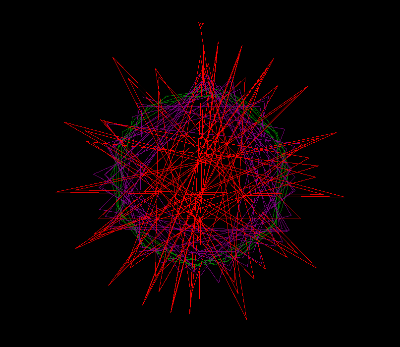

# 🐍 Python Turtle Spiral

Welcome to the **Python Turtle Spiral**. This script demonstrates how to create a vibrant geometric pattern using Python's built-in `turtle` graphics library. It’s a perfect **"Hello World"** style project for visual learners.

---

## 📜 Project Description

The program opens a graphics window with a black background and draws an intricate spiral. To demonstrate logic flow, the drawing starts in **green** and then moves to **purple** dynamically switches to **red** as it expands, eventually stopping itself once it reaches a set size.

---

## 👀 Prerequisites

### 1. Install System Dependencies (Tkinter)

Python's `turtle` library relies on Tkinter. Installation varies by OS:

- **Linux (Ubuntu/Debian):**
  ```bash
  sudo apt update && sudo apt install python3-tk -y
  ```

- **macOS:**
  Tkinter is usually bundled with Python. If missing, install via Homebrew:
  ```bash
  brew install python-tk
  ```

- **Windows:**
  Tkinter is included with the official Python installer from python.org. Ensure the "tcl/tk" option is checked during installation.

### 2. Install uv

This project uses [uv](https://docs.astral.sh/uv/) for dependency and environment management.

- **macOS / Linux:**
  ```bash
  curl -LsSf https://astral.sh/uv/install.sh | sh
  ```

- **Windows:**
  ```powershell
  powershell -c "irm https://astral.sh/uv/install.ps1 | iex"
  ```
---

### 3. Sync Dependencies

Navigate to your project folder and let `uv` handle the rest:

```bash
cd Spiral
uv sync
```
---

## ▶️ How to Run

Once dependencies are synced, run the script with `uv`:

```bash
uv run spiral_Image.py

```

> [!NOTE]
> A window will appear showing the animation. Something like this.

---

## 📸 Screenshot



---

## 🎨 Formatting & Linting

This project uses [ruff](https://docs.astral.sh/ruff/) for fast Python linting and formatting.

```bash
# Format the code
uv run ruff format

# Check for lint issues
uv run ruff check

# Auto-fix lint issues
uv run ruff check --fix

```
---

## 👇 Code Concepts Used

This script bridges the gap between code and art by using:

- **Libraries**: Importing `turtle` to handle the heavy lifting of window management and drawing.
- **Variables**: Tracking `distance` and `angle` to determine where the "pen" moves next.
- **Loops**: Using a `while` loop to repeat drawing actions without writing hundreds of lines of code.
- **Conditionals**: Using `if` statements to change the color based on the spiral's size and to `break` (stop) the loop when the drawing is finished.

---

## 🤝 Contributing

This project is part of a personal learning journey. While I am not accepting Pull Requests to the main branch, I encourage you to fork the repository and experiment with your own changes! Please see CONTRIBUTING.md for more details.

---

## 📄 License

This project is licensed under the [MIT License](LICENSE).
